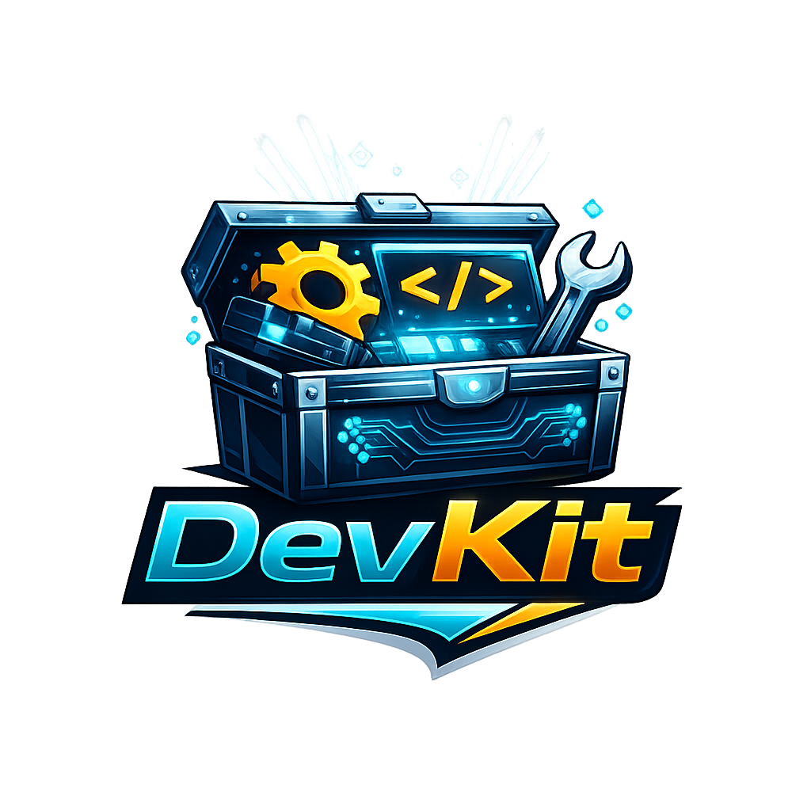

# devkit-profiles



**Named `.env` profiles**, safe switching with backups, and **drift reports** across files — all from one Composer binary: **`./vendor/bin/devkit-env`**.

Package: **`devkit/env`**. Composer also links **`./vendor/bin/devkit-env-diff`** (same program).

---

## Why this exists

Managing several environments usually means several files: `.env`, `.env.staging`, secrets in CI, and the question “does production still match what we think?” This tool gives you a **small profile store** under your repo, a **predictable `use` workflow** (with backups and optional post-switch hooks), and a **`diff` command** to compare any set of env files side by side or as JSON.

---

## Prerequisites

- PHP **8.3+**
- Composer

---

## Install

```bash
composer require devkit/env
```

From a clone of this repo:

```bash
composer install
```

---

## Run from the project root

The CLI resolves **paths** and **`.devkit-env.json`** relative to the directory you run it from. Use your **application root** (where `composer.json` and usually `.env` live).

**Recommended:** Composer’s `vendor/bin` entrypoint:

```bash
./vendor/bin/devkit-env --help
```

Same binary, alternate name:

```bash
./vendor/bin/devkit-env-diff --help
```

**Other ways to invoke it:**

```bash
composer exec devkit-env -- --help
php vendor/bin/devkit-env --help
```

**Windows:** `vendor\bin\devkit-env.bat` or `php vendor\bin\devkit-env` from the project root.

---

## At a glance

| Command | In one sentence |
|--------|------------------|
| **`save`** | Copy **`./.env`** (or **`--from`**) into a named profile in the store. |
| **`use`** | Copy a saved profile onto **`defaultEnv` / `targetEnv`** (usually `.env`), with backup. |
| **`list`** | Print profile names. |
| **`delete`** / **`rm`** | Remove a profile from the store (does not change your working `.env` unless you **`use`**). |
| **`diff`** | Compare multiple env files: missing keys, extras, value drift, optional masking. |
| **`merge`** | Merge **two** files interactively or with **`--prefer`** for scripts. |

Legacy: arguments that **start with `-`** are still handled as **`diff`** (no `diff` subcommand), matching older releases.

---

## Configuration

Optional file **`.devkit-env.json`** in the project root controls store paths, which file **`use`** writes to, and hooks after a successful switch.

**Important:** **`defaultEnv`** and **`targetEnv`** only affect **`use`**. When **`save`** runs **without** **`--from`**, it always reads **`./.env`** in the project root — not these keys.

```json
{
  "storeDir": "env",
  "backupDir": "env/backups",
  "defaultEnv": ".env",
  "afterSwitch": [
    "php artisan config:clear",
    "php artisan cache:clear"
  ],
  "afterSwitchProfiles": {
    "production": [
      "php artisan migrate --force --no-interaction"
    ]
  }
}
```

| Key | Role |
|-----|------|
| **`storeDir`** | Directory for saved profile files and `registry.json`. |
| **`backupDir`** | Where **`use`** stores timestamped backups of the file being replaced. |
| **`defaultEnv`** | Path **`use`** applies a profile to (often `.env`). Relative unless absolute. |
| **`targetEnv`** | Same meaning as **`defaultEnv`** for **`use`**. If both are set, **`targetEnv` wins**. |
| **`afterSwitch`** | Shell commands run after **every** successful **`use`** (from project root). |
| **`afterSwitchProfiles`** | Extra commands for specific profile **names** (runs after **`afterSwitch`**). |

**One-off overrides** (see command sections below):

```bash
./vendor/bin/devkit-env use staging --target other/path/.env
./vendor/bin/devkit-env save --name snapshot --from other/path/.env
```

Skip hooks for a single run:

```bash
./vendor/bin/devkit-env use staging --skip-hooks
```

---

## Files and folders

With defaults (or matching **`storeDir`** / **`backupDir`** in config):

- **`env/`** — profile files (e.g. `staging.env`) and **`env/registry.json`** (name → file).
- **`env/backups/`** — backups created when **`use`** replaces the target file.

On first **`save`**, **`use`**, **`list`**, or **`delete`**, a marked block is appended to **`.gitignore`** so the store and backups stay local. You can commit **`.devkit-env.json`** (paths only); keep secrets and **`env/`** out of version control.

---

## `save` — snapshot a file into a named profile

Copies content **into** the profile store under a label. Without **`--from`**, the source is always **`./.env`** (project root), regardless of **`defaultEnv`** in JSON.

```bash
# Save current ./.env as profile "staging"
./vendor/bin/devkit-env save staging

# Explicit name (same as positional)
./vendor/bin/devkit-env save --name staging

# Snapshot a different file
./vendor/bin/devkit-env save staging --from .env.staging
./vendor/bin/devkit-env save --name staging --from config/env/prod.env
```

Overwrite an existing profile without prompts in automation:

```bash
./vendor/bin/devkit-env save staging --force
```

**Interactive (TTY):** run **`./vendor/bin/devkit-env save`** with no name — pick a profile by number or type a new name.

---

## `use` — apply a profile to your working env file

Copies a **saved** profile onto the configured target (usually **`.env`**), **backing up** the previous file unless you opt out.

```bash
./vendor/bin/devkit-env use staging

# Write to a specific file for this run only
./vendor/bin/devkit-env use staging --target .env.local

# Custom backup location
./vendor/bin/devkit-env use staging --backup-dir /tmp/env-backups

# Replace in place without keeping a backup copy
./vendor/bin/devkit-env use staging --no-backup
```

**Interactive (TTY):** **`./vendor/bin/devkit-env use`** without a profile name shows a numbered list.

---

## `list` — show saved profile names

```bash
./vendor/bin/devkit-env list
```

Prints one name per line, or **`(no profiles saved yet)`** if the store is empty.

---

## `delete` / `rm` — remove a profile from the store

Removes the registry entry and the file under **`storeDir`**. Does **not** change your current working **`.env`** unless you run **`use`** afterward.

```bash
./vendor/bin/devkit-env delete staging
./vendor/bin/devkit-env rm staging
```

Skip the confirmation prompt in a TTY:

```bash
./vendor/bin/devkit-env delete staging --force
```

**Interactive (TTY):** run **`delete`** or **`rm`** without a name to pick from a list; you still confirm unless **`--force`**.

---

## `diff` — drift between env files

Compare a **baseline** to one or more **targets**: missing keys, extra keys, and mismatched values. Values are **masked** by default for sensitive-looking keys; use **`--no-mask`** or **`--mask-key`** to tune that.

```bash
./vendor/bin/devkit-env diff \
  --baseline=local \
  --env local=examples/env/local.env \
  --env staging=examples/env/staging.env \
  --env production=examples/env/production.env
```

**Output format:**

```bash
./vendor/bin/devkit-env diff --env a=examples/env/local.env --env b=examples/env/staging.env \
  --format text

./vendor/bin/devkit-env diff --env a=examples/env/local.env --env b=examples/env/staging.env \
  --format json

./vendor/bin/devkit-env diff --env a=examples/env/local.env --env b=examples/env/staging.env \
  --format side-by-side
# aliases: --format wide   or   --format sidebyside
```

**Masking:**

```bash
./vendor/bin/devkit-env diff --env local=.env --env prod=.env.prod --no-mask

./vendor/bin/devkit-env diff --env local=.env --env prod=.env.prod \
  --mask-key 'APP_*' --mask-key 'STRIPE_*'
```

**Legacy invocation** (no `diff` keyword): same parser as before.

```bash
./vendor/bin/devkit-env --baseline=local \
  --env local=.env \
  --env prod=.env.prod
```

**Exit codes:** **0** no drift, **1** drift (or structural differences), **2** error.

---

## `merge` — combine two `.env` files

Takes **`--left`** and **`--right`**, produces one merged env. In a TTY you resolve conflicts interactively; in scripts use **`-n` / `--no-interaction`** with **`--prefer left`** or **`--prefer right`**.

```bash
./vendor/bin/devkit-env merge \
  --left examples/env/local.env \
  --right examples/env/staging.env \
  --out merged.env
```

Print merged content to stdout (no **`--out`**):

```bash
./vendor/bin/devkit-env merge --left .env --right .env.staging
```

**Non-interactive** (required **`--prefer`** when there are conflicts):

```bash
./vendor/bin/devkit-env merge --left .env --right .env.staging --out merged.env \
  -n --prefer right
```

**Dry run:** show what would be merged; with **`--out`**, print the bytes that would be written **without** creating the file.

```bash
./vendor/bin/devkit-env merge --left .env --right .env.staging --dry-run --out merged.env
```

Optional: **`--no-mask`**, repeatable **`--mask-key PATTERN`** for interactive prompts.

---

## Library API

Install loads Composer’s autoloader; most people only need the CLI.

```php
require __DIR__ . '/vendor/autoload.php';

// e.g. Devkit\Env\Diff\EnvFileParser, Devkit\Env\Store\ProjectConfig::load(), …
```

Namespaces:

- **`Devkit\Env\Diff\`** — parsing, comparison, masking, report formatters.
- **`Devkit\Env\Store\`** — config, profile save/apply/list/delete, registry, gitignore hooks, post-switch runner.

---

## Development

```bash
composer run tests
composer run standards:check
```

---

## License

MIT
